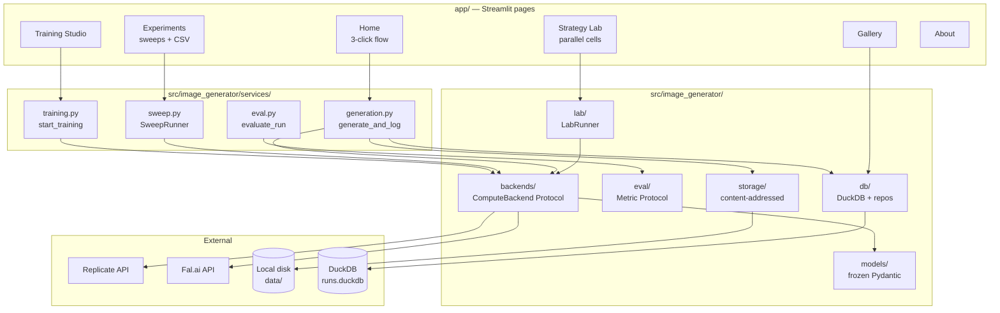
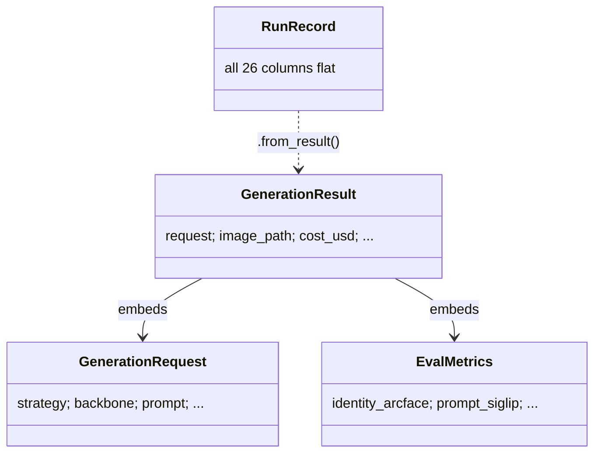
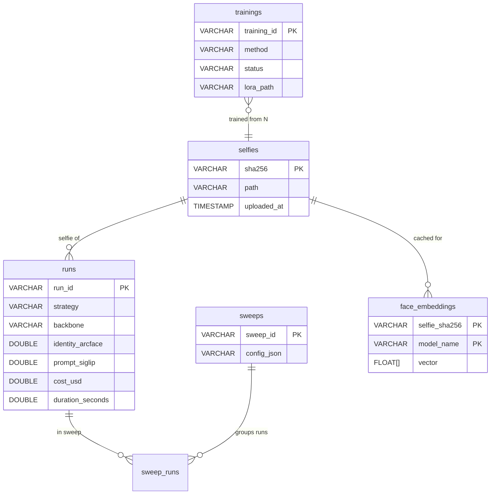
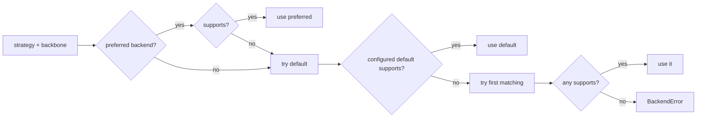
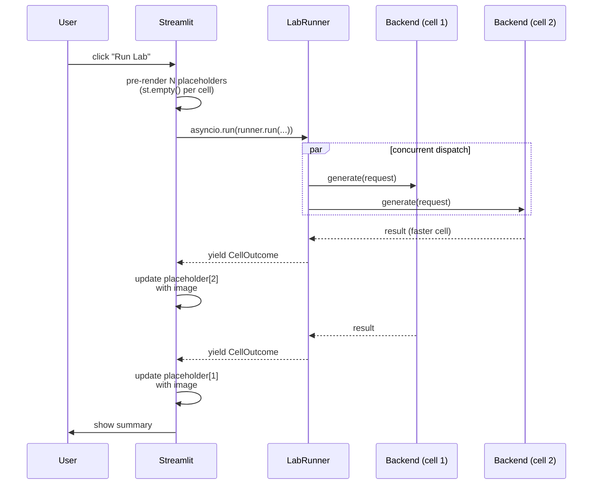
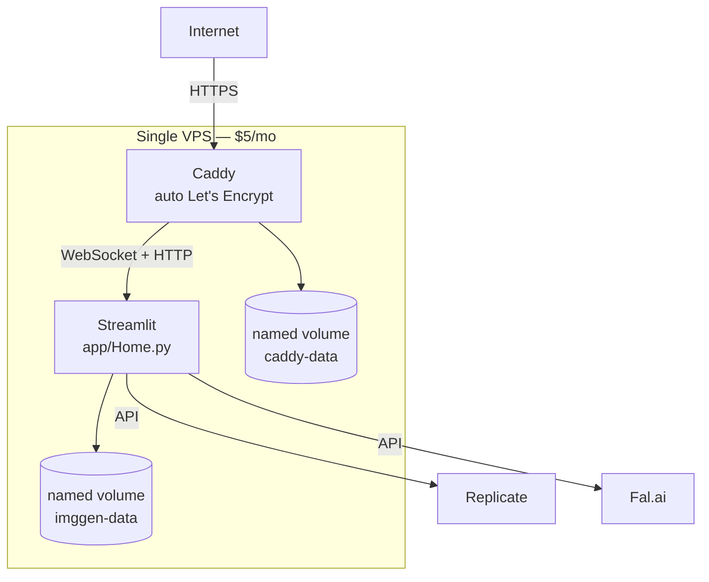

# Architecture deep-dive: building image-generator

*A technical companion to [the field-guide article](article.md). For engineers
reviewing the code, this writes down the seven decisions worth defending, the
bugs they prevented (or caused), and what would change in v2.*

---

## Audience

This isn't a tutorial. It assumes Python 3.12, asyncio, Pydantic v2, and a
working idea of what diffusion models do. The goal is to make the architectural
record explicit: not just *what* the code does, but *why* each pivotal call was
made — including the calls that broke and got revised.

If you're reading the [companion field-guide article](article.md), this is the
"…and here's how it was actually built" appendix.

## The system in one diagram



## The seven decisions worth defending

| # | Decision | Alternative considered | Reason it won |
|---|---|---|---|
| 1 | Frozen Pydantic v2 models as the spine | Dataclasses, attrs, hand-rolled dicts | Validation + JSON round-trip + immutability free; Pydantic v2 is 5–50× faster than v1 ([source](https://docs.pydantic.dev/latest/blog/pydantic-v2-final/)) |
| 2 | `(Strategy × Backbone)` catalog as **data** | Hardcoded in pages | Adding a 7th strategy is a 4-line data change, not a refactor |
| 3 | DuckDB instead of SQLite | SQLite + raw SQL | 10–100× faster on the analytical queries the Experiments page does ([benchmark](https://duckdb.org/why_duckdb)) |
| 4 | `async` ComputeBackend Protocol (not ABC) | Sync ABC with executor wrapping | Vendor SDKs are async-native; wrapping sync→async leaks the Streamlit event loop |
| 5 | Per-call vendor client construction | Long-lived clients in `__init__` | `httpx.AsyncClient` binds to the loop it was created on; Streamlit creates a fresh loop per click → "Event loop is closed" |
| 6 | BLAKE2b per-cell seed derivation | Reuse base seed across cells | Different backbones consume initial noise differently; same int ≠ same noise |
| 7 | Lazy ML imports gated by `eval` extra | Top-level imports, single install | Core install stays at 250 MB; eval extra adds 2 GB+ only when needed |

The rest of this document goes through each of these in depth, plus the four
bugs we hit and what they taught us.

---

## 1. The data contract is the spine

Everything routes through `models/`. Three frozen Pydantic models, no
duplication:

```python
# src/image_generator/models/requests.py
class GenerationRequest(BaseModel):
    model_config = ConfigDict(frozen=True)
    strategy: Strategy
    backbone: Backbone
    prompt: str = Field(..., min_length=1, max_length=2000)
    selfie_sha256: str | None = ...
    seed: int = Field(default=0, ge=0, le=2**31 - 1)
    # ...

    def validate_request_consistency(self) -> None:
        """Cross-field validation. Called explicitly — see note below."""
        if self.strategy is not Strategy.PROMPT_ONLY and self.selfie_sha256 is None:
            raise ValueError(f"strategy={self.strategy} requires a selfie")
        if self.strategy is Strategy.LORA and not self.lora_name:
            raise ValueError("strategy=lora requires lora_name")
        if self.width % 8 != 0 or self.height % 8 != 0:
            raise ValueError("width and height must be multiples of 8")
```

**Why frozen.** Mutating a request mid-pipeline is a class of bug we don't want.
Want a variant? `request.model_copy(update={"seed": 42})` returns a new instance
and the old one is unchanged. The Strategy Lab depends on this — it builds 6
variants from one base request and runs them concurrently. Mutation would mean
race conditions.

**Why not `field_validator` for cross-field rules.** Pydantic v2's `field_validator`
runs per-field; access to sibling fields requires `model_validator(mode='after')`,
which complicates `model_validate` and adds runtime overhead to every construction.
Instead we keep validation cheap on construction (pure type-coercion) and call
`validate_request_consistency()` explicitly at the orchestration layer (in
`services/generation.py`). Same correctness; cleaner separation.

**Why `RunRecord` is separate from `GenerationResult`.** Both exist:



`GenerationResult` is the rich runtime object; `RunRecord` is the flat shape
that goes into DuckDB. The flattening is one-way (`RunRecord.from_result()`)
and exists because analytical SQL like `GROUP BY strategy WHERE guidance_scale > 5`
should not require joins. The Experiments page does many of these queries; the
flat schema makes them trivial and fast.

---

## 2. The catalog as data, not code

```python
# src/image_generator/strategies/catalog.py
CATALOG: tuple[StrategyCell, ...] = (
    StrategyCell(Strategy.PROMPT_ONLY, Backbone.SDXL, "Baseline", "..."),
    StrategyCell(Strategy.INSTANT_ID, Backbone.SDXL, "Strong ID, pose-locked", "..."),
    StrategyCell(Strategy.PHOTOMAKER, Backbone.SDXL, "Prompt-flexible ID", "..."),
    StrategyCell(Strategy.PULID, Backbone.FLUX_DEV, "SOTA zero-shot", "..."),
    StrategyCell(Strategy.LORA, Backbone.SDXL, "Per-subject LoRA (SDXL)", "...", requires_training=True),
    StrategyCell(Strategy.LORA, Backbone.FLUX_DEV, "Per-subject LoRA (FLUX)", "...", requires_training=True),
    # ...
)
```

The Strategy Lab page reads this tuple to build its checklist. The About page
reads it to render the strategy reference. The backends read their respective
`_MODELS` dicts (keyed by `(Strategy, Backbone)`) to map cells to model versions.
Adding **PuLID-FLUX during the build** required:

1. Adding `PULID` to the `Strategy` enum (1 line)
2. Adding a `StrategyCell` to the catalog (1 line)
3. Adding the version pin to `REPLICATE_MODELS` and `FAL_MODELS` (2 lines)
4. Adding the per-strategy input mapping in `_build_input` (4 lines for FLUX-specific keys)

**No UI code changed.** That's the test of the catalog-as-data decision: can a
new strategy be added without touching pages?

---

## 3. DuckDB over SQLite

The Experiments page does this query when you click "Show me runs grouped by
guidance_scale":

```sql
SELECT guidance_scale,
       AVG(identity_arcface) AS avg_id,
       AVG(prompt_siglip)    AS avg_prompt,
       AVG(cost_usd)         AS avg_cost,
       COUNT(*)              AS n
FROM runs
WHERE strategy = 'instant_id' AND completed_at > NOW() - INTERVAL '7 days'
GROUP BY guidance_scale
ORDER BY guidance_scale;
```

Across 10,000 runs (a single power-user month), DuckDB's columnar engine
returns this in a few milliseconds; SQLite's row-store walks every row. DuckDB
publishes [TPC-H benchmark numbers](https://duckdb.org/why_duckdb) showing
order-of-magnitude wins on aggregations, joins over multiple columns, and any
`GROUP BY` with sufficient cardinality.

**The gotcha.** DuckDB is single-writer per file. We learned this twice:

1. The smoke tests originally tried to open `data/runs/runs.duckdb` while the
   live Streamlit dev server held the lock. They failed with `IO Error:
   Conflicting lock`. Fix: per-test DB isolation via a `tmp_path` fixture
   (`tests/test_app_smoke.py:_isolated_db`).
2. We protect writes with a process-local `RLock` so concurrent Streamlit
   pages in the same process serialize writes properly:

```python
# src/image_generator/db/connection.py
class Database:
    def __init__(self, path: Path | str = ":memory:") -> None:
        self._lock = threading.RLock()
        self._conn = duckdb.connect(self._path)

    @property
    def lock(self) -> threading.RLock:
        return self._lock

# Usage:
with db.lock:
    db.conn.execute("INSERT INTO runs VALUES (...)")
```

For multi-process scenarios (Docker scaling), you'd swap to PostgreSQL and the
single-writer constraint goes away. For a single-VPS deploy serving one user,
DuckDB is the right answer.

**Schema sketch:**



---

## 4. Async ComputeBackend Protocol

```python
# src/image_generator/backends/base.py
@runtime_checkable
class ComputeBackend(Protocol):
    name: BackendName

    def supports(self, strategy: Strategy, backbone: Backbone) -> bool: ...
    def quote(self, request: GenerationRequest) -> Quote: ...

    async def generate(
        self, request: GenerationRequest, selfie_bytes: bytes | None
    ) -> GenerationResult: ...

    async def train_lora(self, *, method, archive_url, name, destination, ...) -> str: ...
    async def training_status(self, job_id: str) -> dict[str, object]: ...
    async def health(self) -> bool: ...
```

**Why Protocol, not ABC.** Two reasons:
1. **Structural typing.** `Protocol` lets us treat `ReplicateBackend` and
   `FalBackend` as instances of `ComputeBackend` without inheritance plumbing.
   Tests can supply a `class FakeBackend:` with the right methods and it just
   works.
2. **`@runtime_checkable`** enables `isinstance(b, ComputeBackend)` for runtime
   sanity checks without forcing a class hierarchy.

**Why async-native.** `replicate.async_run` and `fal_client.subscribe_async`
are async-first (their internals use `httpx.AsyncClient`). Wrapping them in
`run_in_executor` to fit a sync API would (a) leak the Streamlit event loop,
and (b) defeat the parallelism the Strategy Lab depends on:

```python
# src/image_generator/lab/runner.py
async def run(self, *, cells, base_request, selfie_bytes):
    tasks = [asyncio.create_task(self._run_cell(c, base_request, selfie_bytes))
             for c in cells]
    for coro in asyncio.as_completed(tasks):
        yield await coro
```

`asyncio.as_completed` is the magic — outcomes stream back to the caller as
each cell finishes, regardless of dispatch order. With six cells and a 4-cell
semaphore, the first three finish in ~10–25s (vendor-dependent), the next
batch in another ~10–25s. Total wall time: ~25–50s for all six, vs ~150s if
serialized.

**Backend resolution priority:**



Backends without credentials are silently dropped from the registry — pages
check `registry.available` to decide what UI to show.

---

## 5. Per-call vendor client construction

This was bug #2 (chronologically). The original code:

```python
# WRONG — what we had first
class ReplicateBackend:
    def __init__(self, api_token: str) -> None:
        self._client = replicate.Client(api_token=api_token)  # built once
```

Worked fine on the first request. Failed on the second with:

```
Replicate call failed for ...: Event loop is closed
```

The root cause is subtle. `replicate.Client` holds an `httpx.AsyncClient`
internally. `httpx.AsyncClient` binds its connection pool to the **event loop
that's current at construction time**. Streamlit's pattern is `asyncio.run()`
per button click, which:

1. Creates a fresh event loop
2. Runs the coroutine
3. Closes the loop

On the second click, a new loop exists but the cached httpx client still
references the *first* loop's connection pool — which is dead. Hence the error.

The fix is to construct clients per-call, inside the async method:

```python
# CORRECT
class ReplicateBackend:
    def __init__(self, api_token: str) -> None:
        self._api_token = api_token

    def _new_client(self) -> Any:  # replicate.Client
        # Per-call. The internal httpx.AsyncClient binds to the current loop;
        # Streamlit's asyncio.run() creates a fresh loop per click, so a long-
        # lived client dies with "Event loop is closed" on the second request.
        return replicate.Client(api_token=self._api_token)

    async def generate(self, request, selfie_bytes):
        client = self._new_client()
        output = await client.async_run(model_ref, input=...)
```

The cost: ~50ms of overhead per call to spin up a new httpx pool. Invisible
next to ~10–25s generation time.

The same fix applies to `FalBackend` (uses `fal_client.AsyncClient` per-call
instead of the module-level cached `fal_client.subscribe_async`).

This is one of those patterns nobody warns you about until you hit it. If
you're using any vendor async SDK from inside Streamlit, **construct
per-call**.

---

## 6. The BLAKE2b seed derivation

```python
# src/image_generator/lab/runner.py
def _derive_seed(base_seed: int, strategy: Strategy, backbone: Backbone) -> int:
    """Deterministic per-cell seed that's reproducible but distinct per cell."""
    key = f"{base_seed}|{strategy.value}|{backbone.value}".encode()
    digest = hashlib.blake2b(key, digest_size=4).digest()
    return int.from_bytes(digest, "big") & 0x7FFFFFFF
```

**The bug we prevented.** Naively passing `base.seed` to every cell looks like
"all cells use the same seed for reproducibility." It isn't — each backbone
consumes initial noise differently (latent shape, sampler scheduling, even
text-encoder tokenization paths can differ). "Same integer seed across
backbones" produces qualitatively different noise patterns; what looks like a
controlled comparison is actually unintentionally randomized.

The fix: per-cell deterministic seed. Same selfie + same prompt + same
`base_seed` → same per-cell seed every rerun, but cells differ from each other.

**Why BLAKE2b instead of SHA-256.** BLAKE2b is faster (single-pass, optimized
for software, ~3 GB/s on modern CPUs vs SHA-256's ~500 MB/s) and explicitly
designed for non-cryptographic hashing use cases. RFC 7693 specifies it; it's
in `hashlib` since Python 3.6.

The 4-byte digest size and the `& 0x7FFFFFFF` mask are because Python's
`random.seed` and most diffusion samplers want a 31-bit positive int.

---

## 7. Lazy ML imports + the `eval` extra

The eval modules (`identity.py`, `prompt.py`, `aesthetic.py`, `diversity.py`)
need PyTorch, InsightFace, OpenCLIP, LPIPS — collectively ~2 GB of wheels and
weights. We can't make those a hard dependency:

- The basic install stays at ~250 MB and runs in seconds.
- CI doesn't need to download CUDA wheels to run unit tests.
- The Streamlit UI works for users who haven't installed the eval extra (the
  metric badges just don't render).

The solution: heavy imports go *inside* `compute()`, not at module top:

```python
# src/image_generator/eval/prompt.py
class SiglipPromptAdherence(Metric):
    def load(self) -> None:
        try:
            import open_clip
            import torch
        except ImportError as e:
            raise ImportError(
                "SigLIP requires the eval extra: `make install-eval`"
            ) from e
        # ... actual model loading ...
```

The `EvalHarness` catches `ImportError` (and any other exception) and stores
`score=None` rather than failing the run:

```python
# src/image_generator/eval/harness.py
def evaluate(self, ctx: MetricContext) -> list[MetricResult]:
    results = []
    for metric in self._metrics:
        if not metric.applicable(ctx):
            results.append(MetricResult(name=metric.name, score=None))
            continue
        try:
            self._ensure_loaded(metric)
            results.append(metric.compute(ctx))
        except NotImplementedError:
            results.append(MetricResult(name=metric.name, score=None))
        except Exception as e:
            log.warning("eval.metric_failed", metric=metric.name, error=str(e))
            results.append(MetricResult(name=metric.name, score=None))
    return results
```

Three failure modes all degrade to NULL in the DB column: not applicable, not
implemented, broken. Generation never fails because of telemetry. This is the
same fail-open philosophy that lives throughout the codebase.

---

## 8. Streamlit + asyncio: streaming results to the UI

The Strategy Lab pre-renders N empty placeholders, then asyncio-streams
outcomes into them as cells finish:



The key trick: `st.empty()` returns a placeholder object. Calling
`placeholder.container()` *inside* the async loop replaces the placeholder's
contents with a fresh container. Streamlit pushes the update to the browser
over its WebSocket immediately, even though the Python thread is still inside
`asyncio.run()`. So users see cells stream in live.

```python
# app/pages/3_Strategy_Lab.py — simplified
async def _stream(runner, cells, base_request, selfie_bytes, placeholders):
    async for outcome in runner.run(...):
        with placeholders[outcome.cell].container(border=True):
            if outcome.result is not None:
                st.image(str(outcome.result.image_path))
                st.caption(f"{outcome.elapsed_seconds:.1f}s")
            else:
                st.error(f"Failed: {outcome.error}")

asyncio.run(_stream(runner, cells, base_request, selfie_bytes, placeholders))
```

For pages that need *true* push-driven updates (e.g. the Training Studio's
auto-refresh of training status), we use `st.fragment(run_every=10)` —
Streamlit's per-fragment auto-rerun, introduced in 1.30. Works well for
status-polling but expensive enough that we leave it opt-in (a toggle).

---

## 9. Content-addressed storage

```python
# src/image_generator/storage/local.py
def put_selfie(self, data: bytes, sha256: str) -> Path:
    # Shard by first 2 hex chars to avoid giant directories at scale.
    shard = self._selfies_dir / sha256[:2]
    shard.mkdir(parents=True, exist_ok=True)
    path = shard / f"{sha256}.png"
    if not path.exists():
        path.write_bytes(data)
    return path
```

Selfies live at `data/selfies/<aa>/<sha256>.png`. The first-2-hex sharding
gives 256 directories at the top level, each containing some fraction of the
selfies — keeps any single directory under ~10k entries even with millions of
uploads. Filesystems like ext4 and APFS handle large directories fine these
days, but tools (`ls`, `find`) get noticeably slower past ~50k entries.

The `Storage` Protocol means swapping to S3/R2 is one new file
(`storage/s3.py`) implementing the same five methods. No callers change.

---

## 10. Tests: 60 of them, in three layers

```
tests/
├── conftest.py            shared fixtures (in-memory DB, sample request/result)
├── test_models.py         frozen models, validation, JSON round-trip
├── test_db.py             schema + repos against in-memory DuckDB
├── test_backends.py       adapters with mocked vendor SDKs
├── test_lab_runner.py     seed derivation + outcome handling
├── test_sweep.py          cartesian-product expansion + persistence
├── test_eval.py           harness orchestration with FakeMetric
└── test_app_smoke.py      every Streamlit page runs without exception
```

The key choice was using **Streamlit's `AppTest` framework** for the smoke
tests. `AppTest.from_file(path).run()` simulates a full first-render
in-process — no browser needed. If a page top-level raises, `at.exception`
collects it and we fail the test:

```python
@pytest.mark.parametrize("page", PAGES, ids=lambda p: p.stem)
def test_page_renders(page: Path) -> None:
    at = AppTest.from_file(str(page), default_timeout=30)
    at.run()
    if at.exception:
        details = "\n".join(str(e.value) for e in at.exception)
        pytest.fail(f"Page {page} raised:\n{details}")
```

This is the cheapest way to catch the most common bug class — top-level
imports breaking, `bootstrap_session` failing, page state initialization
errors. It runs in ~5s and saved us during the per-call-client refactor when
we accidentally broke the live tests.

The integration tests (`@pytest.mark.integration @pytest.mark.slow`) hit real
APIs / real ML models. They skip by default; CI doesn't run them.

---

## 11. Deploy: Docker + Caddy + persistent volume



**Caddy over nginx + certbot.** Caddy's TLS automation is one line in the
Caddyfile — `{$DOMAIN} { reverse_proxy app:8501 }`. nginx + certbot is more
configuration plus a renewal cron.

**Named volume vs bind mount.** Named volumes (`imggen-data`) survive
`docker compose down -v` *unless you pass `-v`*; bind mounts to host paths
are easy to mess up across server moves. Named volume backups go through a
one-line `docker run alpine tar` invocation.

**Why no Postgres.** Single-user deploy, single-process Streamlit, DuckDB
fits in a file. Adding Postgres is the easy upgrade path when scaling beyond
one user — the `db/repository.py` layer hides DuckDB's specifics enough that
swapping to `psycopg` would be ~50 lines of change in one file.

---

## What broke (and what we learned)

### Bug 1 — `404 Not Found` on bare model slugs

```
Replicate call failed for zsxkib/instant-id: 404 The requested resource could not be found.
```

`replicate.async_run("owner/model")` does **not** auto-resolve to
`latest_version` in SDK 1.0.7. You must pass `"owner/model:<sha>"`. We added
the version pin; this is also a small reproducibility win (a model author
can't change the default version under you).

**Lesson:** pin every model version. The 4-line catalog comment in
`backends/replicate.py` documents how to refresh hashes via the Replicate API.

### Bug 2 — `Event loop is closed` on the second request

Covered in §5. Fixed by per-call client construction.

**Lesson:** any vendor async SDK + Streamlit is suspect. Always construct
clients inside the async method, not at object init.

### Bug 3 — Smoke tests fail with `Conflicting lock`

DuckDB is single-writer per file. Tests opening the same `.duckdb` as a
running dev server conflict. Fixed with a `tmp_path` fixture that points
each test at its own database (`tests/test_app_smoke.py:_isolated_db`).

**Lesson:** test isolation is cheaper than coordinated state. Default to
"each test gets a fresh DB."

### Bug 4 — Eval install stalls on slow PyPI

`uv sync --extra eval` downloads ~2 GB of wheels (PyTorch, InsightFace, etc.).
On unreliable networks, downloads time out and the install hangs. We made the
metric implementations **lazy-import** so the basic app works regardless:
metric badges just don't show up until `make install-eval` succeeds. The page
catches the `ImportError` and surfaces a one-line "install the eval extra"
hint.

**Lesson:** for any optional heavy dep, fail-open at the call site. Never make
the basic UI depend on the heavy install completing.

### Non-bug worth noting — MQTT

We explored adding an MQTT event publisher (fan-out generation events to a
broker for external dashboards / phone notifications). Built it, integrated
it into `services/generation.py`, wrote the tests, then removed it. Reason:
the architectural cost (broker dependency, connection-lifecycle complexity,
schema management) didn't pay back any concrete benefit for a single-user
Streamlit app where every meaningful event already goes into DuckDB.

**Lesson:** willingness to revert is part of the discipline. Adding a
dependency is much easier than removing one once it's in production. If you
can't name the specific problem it solves, take it out.

---

## What I'd do differently

1. **BYO API key from day 1.** The current model assumes the operator's API
   tokens are baked into `.env`. For a public deploy, that's a credit-burn
   target — a sidebar text input that takes a user-supplied key and stores it
   in `st.session_state` would be ~20 lines and would unlock public hosting.

2. **Dynamic LoRA cells.** The `(LORA, SDXL)` and `(LORA, FLUX)` catalog
   cells are placeholders today. After training, a user has a trained LoRA
   in the `trainings` table with a `lora_path` like `username/model:hash`.
   The catalog should expand at runtime to include one cell per trained
   LoRA, so the Strategy Lab can compare *Alex's LoRA on FLUX* vs *Alex's
   LoRA on SDXL* directly. Currently you have to manually paste the
   `lora_name` field on Home.

3. **Cost-cap enforcement.** `IMGGEN_DAILY_SPEND_CAP_USD` is currently
   advisory — displayed in the sidebar but not enforced. For a public deploy
   it should be wired into `services/generation.py` (sum cost from the runs
   table, refuse if today's total > cap).

4. **HuggingFace as a third backend.** The current Replicate + Fal pair both
   need billing. A `HuggingFaceBackend` against the free Inference API
   wouldn't unlock SOTA identity strategies but would give a no-card path
   for prompt-only generations — useful for stakeholder demos when funds
   are zero.

5. **Per-cell metric streaming in the Lab.** Currently the Lab grid streams
   in, then a *second* pass computes metrics for all cells. The metrics
   could compute per-cell as the cell completes, so users see identity
   scores landing live alongside the images.

---

## Quick reference

| Decision | File / line |
|---|---|
| Frozen request validation | `models/requests.py::validate_request_consistency` |
| Strategy × Backbone catalog | `strategies/catalog.py::CATALOG` |
| Per-call Replicate client | `backends/replicate.py::ReplicateBackend._new_client` |
| Per-cell seed derivation | `lab/runner.py::_derive_seed` |
| Eval lazy-import contract | `eval/prompt.py::SiglipPromptAdherence.load` |
| Eval fail-open contract | `eval/harness.py::EvalHarness.evaluate` |
| Streamlit AppTest smoke | `tests/test_app_smoke.py` |
| Caddy auto-TLS | `deploy/Caddyfile` |
| systemd hardening | `deploy/imggen.service` |

## References & further reading

- Pydantic v2 performance — [docs.pydantic.dev/latest/blog/pydantic-v2-final/](https://docs.pydantic.dev/latest/blog/pydantic-v2-final/)
- DuckDB benchmarks — [duckdb.org/why_duckdb](https://duckdb.org/why_duckdb)
- Streamlit AppTest framework — [docs.streamlit.io/library/api-reference/app-testing](https://docs.streamlit.io/library/api-reference/app-testing)
- BLAKE2 spec — [RFC 7693](https://datatracker.ietf.org/doc/html/rfc7693)
- httpx async client lifecycle — [www.python-httpx.org/async/](https://www.python-httpx.org/async/)
- Replicate model versioning — [replicate.com/docs/reference/http#predictions.create](https://replicate.com/docs/reference/http)
- ArcFace identity threshold — [InsightFace model docs](https://github.com/deepinsight/insightface/tree/master/recognition/arcface_torch)
- LAION aesthetic predictor — [github.com/LAION-AI/aesthetic-predictor](https://github.com/LAION-AI/aesthetic-predictor)
- Caddy automatic HTTPS — [caddyserver.com/docs/automatic-https](https://caddyserver.com/docs/automatic-https)

---

*Repo: [github.com/MUNENE1212/image-generator](https://github.com/MUNENE1212/image-generator) ·
field-guide companion: [docs/article.md](article.md) ·
written 2026-04 · code [@MUNENE1212](https://github.com/MUNENE1212).*
